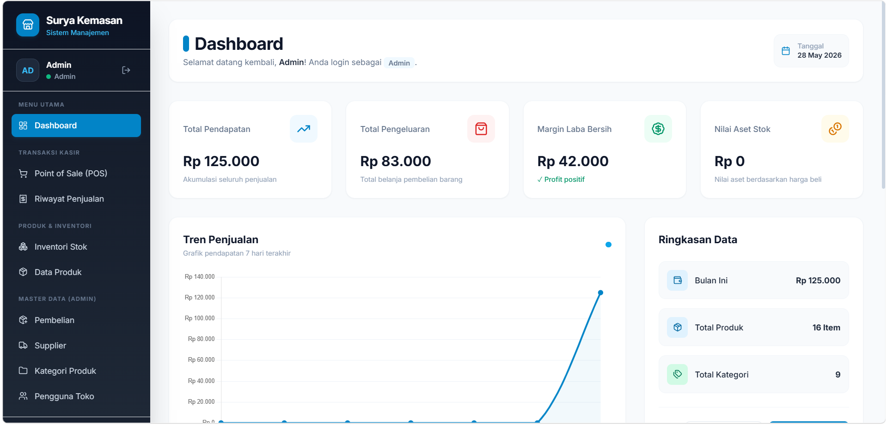

# 🏪 IPOS - Sistem Manajemen Toko Surya Kemasan

> **Aplikasi POS & Manajemen Inventori Modern untuk Toko Kecil & Menengah**

---

## 📸 Preview Dashboard

<div align="center">



*Dashboard interaktif dengan KPI real-time, grafik penjualan, dan ringkasan operasional*

</div>

---

## 📋 Review Singkat

**IPOS** adalah solusi lengkap untuk mengelola operasional toko sehari-hari. Dari sistem kasir (POS), manajemen inventori, pencatatan pembelian supplier, hingga laporan penjualan—semuanya terintegrasi dalam satu aplikasi yang mudah digunakan.

Dibangun dengan teknologi modern namun tetap sederhana, IPOS cocok untuk pemilik toko yang ingin sistem terpercaya tanpa perlu investasi IT yang besar.

### 🎯 Target Pengguna
- Toko retail kecil hingga menengah
- Toko kemasan, makanan, atau general store
- Bisnis yang membutuhkan tracking stok real-time
- Pemilik yang ingin laporan penjualan akurat

### 💻 Tech Stack
| Komponen | Teknologi |
|----------|-----------|
| **Backend** | PHP 7.4+ (Native) |
| **Database** | MySQL / MariaDB |
| **Frontend** | Tailwind CSS, Lucide Icons |
| **Charts** | Chart.js |
| **Architecture** | MVC-inspired, Object-Oriented |

---

## ✨ Fitur Unggulan

### 🔐 **Autentikasi & Manajemen Pengguna**
- Login/logout aman dengan role-based access
- Dua role utama: Admin dan Kasir
- Kelola pengguna toko dengan mudah

### 📊 **Dashboard Cerdas**
- **Untuk Admin:** Total pendapatan, pengeluaran, laba bersih, nilai stok, grafik tren penjualan 7 hari
- **Untuk Kasir:** Ringkasan penjualan hari ini, jumlah transaksi, rata-rata nilai transaksi
- Peringatan stok kritis untuk produk di bawah 6 pcs

### 🛒 **Point of Sale (POS)**
- Interface kasir yang cepat dan intuitif
- Search produk real-time
- Hitung otomatis total belanja + diskon
- Cetak struk transaksi

### 📦 **Manajemen Inventori**
- Tracking stok barang real-time
- CRUD lengkap untuk produk
- Kategori produk terstruktur
- Monitoring stok rendah

### 💰 **Transaksi Bisnis**
- **Penjualan:** Catat semua transaksi dengan detail item, harga, dan kuantitas
- **Pembelian:** Kelola pemesanan dari supplier
- **Supplier:** Database supplier dengan kontak

### 📈 **Laporan & Analytics**
- Riwayat penjualan lengkap dengan filter
- Produk terlaris (Top 5)
- Tren penjualan grafis
- Data pembelian terstruktur

---

## 📂 Struktur Project

```
proyekmbd/
├── auth/                    # Autentikasi & login
│   ├── login.php
│   ├── logout.php
│   ├── process_login.php
│   └── check_auth.php
├── dashboard/               # Dashboard utama
│   └── index.php
├── sales/                   # Modul penjualan & POS
│   ├── index.php           # Riwayat penjualan
│   ├── pos.php             # Aplikasi POS
│   └── ...
├── inventory/              # Manajemen stok
│   └── index.php
├── purchases/              # Modul pembelian
│   └── ...
├── suppliers/              # Database supplier
│   └── ...
├── categories/             # Kategori produk
│   └── ...
├── users/                  # Manajemen pengguna
│   └── ...
├── public/                 # Master data produk
│   └── ...
├── includes/               # Komponen UI bersama
│   ├── header.php         # Tailwind & styling
│   └── navbar.php         # Sidebar navigasi
├── config/                 # Konfigurasi
│   └── database.php       # Koneksi PDO
├── template_clean.sql      # SQL template contoh
├── .env.example            # Template environment
└── README.md               # File ini
```

---

## 🚀 Instalasi & Setup

### Prasyarat
- **PHP 7.4** atau lebih tinggi
- **MySQL 5.7** atau **MariaDB 10.3** ke atas
- **Web Server** (Apache/Nginx)
- **Git** (opsional, untuk clone repo)

### Langkah Instalasi

#### 1️⃣ Clone Repository
```bash
git clone https://github.com/MitanNoel/proyekmbd.git
cd proyekmbd
```

#### 2️⃣ Buat Database
```bash
mysql -u root -p

# Lalu di MySQL console:
CREATE DATABASE db_toko_1 CHARACTER SET utf8mb4 COLLATE utf8mb4_general_ci;
EXIT;
```

#### 3️⃣ Import Data Contoh
```bash
mysql -u root -p db_toko_1 < template_clean.sql
```

#### 4️⃣ Setup Environment (.env)
Salin `.env.example` ke `.env`:
```bash
cp .env.example .env
```

Edit `.env` dengan kredensial database Anda:
```env
DB_HOST=localhost
DB_PORT=3306
DB_DATABASE=db_toko_1
DB_USERNAME=root
DB_PASSWORD=your_password
```

#### 5️⃣ Konfigurasi Web Server

**Untuk Apache:**
```bash
# Copy folder ke webroot
cp -r proyekmbd /var/www/html/

# Akses: http://localhost/proyekmbd/
```

**Untuk Virtual Host (Apache):**
```apache
<VirtualHost *:80>
    ServerName proyekmbd.local
    DocumentRoot /path/to/proyekmbd
    <Directory /path/to/proyekmbd>
        AllowOverride All
        Require all granted
    </Directory>
</VirtualHost>
```
Tambahkan ke `/etc/hosts`: `127.0.0.1 proyekmbd.local`

#### 6️⃣ Jalankan Aplikasi
Buka browser dan akses:
```
http://localhost/proyekmbd/
```

Anda akan otomatis diarahkan ke halaman **Login**.

---

## 🔑 Akun Default (Testing)

Gunakan akun berikut untuk login awal (dari `template_clean.sql`):

| Role | Username | Password |
|------|----------|----------|
| **Admin** | `admin` | `12345` |
| **Kasir** | `kasir` | `12345` |

> ⚠️ **Catatan:** Ubah password ini segera setelah login pertama di production!

---

## 📖 Panduan Penggunaan

### 👨‍💼 **Untuk Admin:**
1. **Dashboard** → Lihat KPI, grafik penjualan, dan peringatan stok
2. **Data Produk** → Tambah/edit produk dan harga
3. **Kategori Produk** → Kelola kategori barang
4. **Supplier** → Daftar supplier dan kontak
5. **Pembelian** → Catat pemesanan ke supplier
6. **Pengguna Toko** → Buat akun kasir baru
7. **Laporan** → Lihat ringkasan penjualan & laba

### 👨‍💻 **Untuk Kasir:**
1. **Dashboard** → Lihat target penjualan hari ini
2. **POS** → Buka aplikasi kasir untuk melayani pelanggan
3. **Riwayat Penjualan** → Lihat transaksi yang sudah diproses
4. **Inventori** → Cek stok produk

---

## ⚙️ Tips & Troubleshooting

### ✅ Tips Umum
- Gunakan **`.env`** untuk menyimpan kredensial database—jangan hardcode di kode!
- Database sudah menyertakan **15 produk contoh** dengan kategori dan transaksi dummy
- Grafik penjualan menampilkan **7 hari terakhir** dari database real
- Peringatan stok akan muncul untuk produk dengan qty < 6 pcs

### 🐛 Troubleshooting

**Error: "Koneksi database gagal"**
- Cek `.env` sudah lengkap semua kredensial
- Pastikan MySQL service running: `systemctl status mysql`
- Verifikasi nama database dan user di MySQL

**POS tidak muncul di menu Kasir**
- Hanya user dengan role `kasir` bisa akses POS
- Login dengan akun `kasir` (jangan `admin`)

**Stok tidak ter-update**
- Stok dihitung otomatis dari `detail_pembelian` - `detail_penjualan`
- Pastikan transaksi sudah disimpan ke database

---

## 📝 Lisensi & Kontribusi

Proyek ini dikembangkan untuk keperluan akademik. Silakan fork, modifikasi, dan gunakan sesuai kebutuhan Anda.

---

## 💬 Pertanyaan & Support

Ada pertanyaan? Hubungi developer atau buka **Issue** di repository ini.

**Selamat menggunakan IPOS! 🎉**
